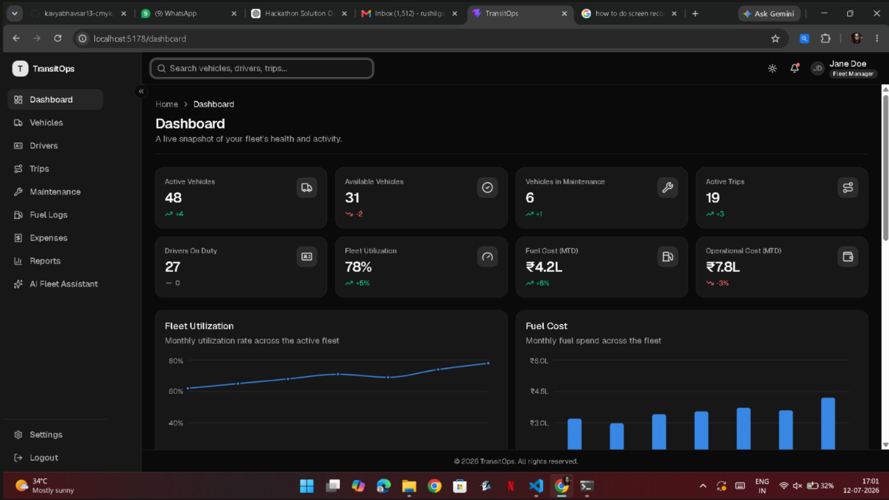

# 🚛 TransitOps – Smart Transport Operations Platform


### 🚀 Odoo Hackathon 2026

---

# 📖 Overview

TransitOps is an intelligent transport operations platform built to digitize and simplify fleet management. It provides organizations with a centralized system to manage vehicles, drivers, trips, maintenance, operational expenses, and analytics while enforcing real-world business rules through automation.

The platform replaces manual spreadsheets with a smart, secure, and scalable solution that improves efficiency, reduces operational errors, and provides actionable business insights.

---

# 💡 Our Solution

TransitOps delivers a complete digital ecosystem for transport management by combining automation, business intelligence, and real-time monitoring.

Our platform enables organizations to:

* 🚛 Manage the complete fleet lifecycle
* 👨‍✈️ Monitor drivers and license validity
* 📦 Create and dispatch trips efficiently
* 🔧 Automate maintenance workflows
* ⛽ Track fuel consumption and operational expenses
* 📊 Visualize fleet performance using dashboards
* 🔐 Secure the system using Role-Based Access Control
* ⚡ Automate business rules and status transitions

---

# ✨ Core Features

## 🔐 Authentication & Authorization

* Secure Login
* JWT Authentication
* Role-Based Access Control (RBAC)
* Protected Routes

---

## 🚚 Fleet Management

* Vehicle Registration
* Vehicle Availability Tracking
* Vehicle Status Management
* Odometer Management
* Load Capacity Tracking
* Acquisition Cost Tracking

---

## 👨‍✈️ Driver Management

* Driver Profiles
* License Verification
* License Expiry Tracking
* Safety Score Monitoring
* Driver Status Management

---

## 🛣 Trip Management

* Create Trips
* Vehicle Assignment
* Driver Assignment
* Cargo Weight Validation
* Trip Lifecycle Management
* Automatic Status Updates

---

## 🔧 Maintenance Module

* Maintenance Logs
* Vehicle Service Records
* Automatic "In Shop" Status
* Maintenance Cost Tracking

---

## ⛽ Fuel & Expense Tracking

* Fuel Logs
* Toll Expenses
* Maintenance Expenses
* Vehicle-wise Operational Cost
* Cost Analysis

---

## 📊 Dashboard & Analytics

Real-time dashboard displaying:

* Active Vehicles
* Available Vehicles
* Vehicles in Maintenance
* Active Trips
* Pending Trips
* Drivers On Duty
* Fleet Utilization
* Fuel Efficiency
* Vehicle ROI
* Operational Cost Analytics

---

# ⚙ Intelligent Business Automation

TransitOps automatically enforces business rules to ensure operational accuracy.

✅ Prevents assigning unavailable vehicles

✅ Prevents assigning unavailable drivers

✅ Validates cargo weight against vehicle capacity

✅ Detects expired driving licenses

✅ Restricts suspended drivers

✅ Automatically updates vehicle status during trips

✅ Automatically updates driver status during trips

✅ Prevents vehicles under maintenance from being dispatched

✅ Restores availability after trip completion

---

# 🏗 System Architecture

```text
                    Next.js Frontend
                           │
                           ▼
                 Express.js REST API
                           │
          ┌────────────────┼────────────────┐
          ▼                ▼                ▼
   Local MongoDB      Prisma ORM      Gemini AI
```

---

# 🛠 Technology Stack

### Frontend

* Next.js
* React
* TypeScript
* Tailwind CSS

### Backend

* Node.js
* Express.js
* TypeScript

### Database

* MongoDB (Local Development Database)
* Prisma ORM

### Authentication

* JWT Authentication
* Role-Based Access Control (RBAC)

### AI Integration

* Google Gemini API

---

# 📂 Project Structure

```text
TransitOps
│
├── frontend
├── backend
├── database
├── docs
└── README.md
```

---

# 🚀 Why TransitOps?

✔ Centralized Fleet Management

✔ Intelligent Driver Assignment

✔ Automated Workflow Management

✔ Real-Time Analytics Dashboard

✔ Fuel & Expense Monitoring

✔ Secure Role-Based Access

✔ Business Rule Validation

✔ Modular & Scalable Architecture

✔ AI-Ready Platform

---

# 📌 Development Note

This project currently uses a **local MongoDB database** for development and demonstration purposes. The architecture is designed to support migration to a cloud-hosted database such as **MongoDB Atlas** with minimal configuration changes.

---

# 📸 Application Preview



* Login
* Dashboard
* Vehicle Registry
* Driver Management
* Trip Management
* Maintenance
* Fuel & Expense Module
* Analytics Dashboard

---

# 🔮 Future Enhancements

* 📍 Live GPS Vehicle Tracking
* 🤖 AI-Based Route Optimization
* 🔔 Real-Time Notifications
* 📱 Mobile Application
* 📄 PDF & CSV Reports
* 📧 Automated Email Alerts
* 📈 Predictive Maintenance
* 🌐 Cloud Database Deployment

---

# 👨‍💻 Team

### Team Name

"""Adani bangers"""

### Team Members

* Kavya Bhavsar
* Urmi Dodia
* Rushil Gajjar
* Harshvardhan Doriya

---

# ❤️ Developed For

## Odoo Hackathon 2026

**Building smarter, safer, and more efficient transport operations through intelligent automation.**